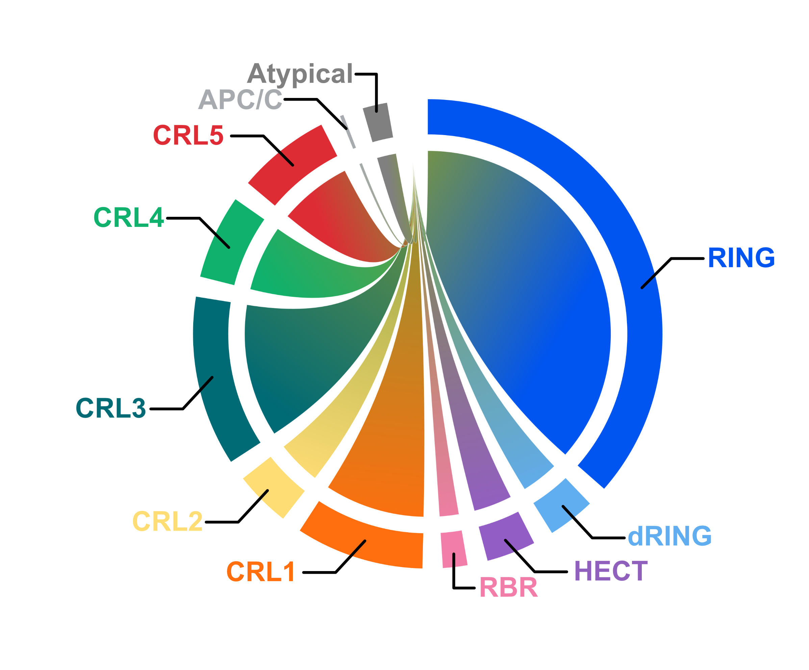

# E3-ome

A curated resource for exploring the human E3 ligase landscape, including annotations, classification, and functional insights. This project aims to support discovery of E3 ligases in the research community.

## 🔬 Features
- Curated E3 ligase dataset
- Updated to include additional E3 ligases

## 🚀 Access
- Web app: https://shiny.wehi.edu.au/chua.n/E3app/
- Paper: (coming soon)

## 📊 Usage
We welcome contributions to the human E3-ome annotation. Please contact feltham.r@wehi.edu.au or chua.n@wehi.edu.au .

If you find the E3-ome useful, please consider citing our publication: Chua NK, González-Robles TJ, Reddington CJ, Dudley-Fraser J, Birkinshaw RW, Han J, Solano A, Wong SW, Kochańczyk T, Peter JJ, Nakasone MA, Aust F, Munro J, Tong YH, Iskander J, Abeysekera W, Garnham A, Huckstep H, Ritchie ME, Wertz I, Hymowitz S, Kumar S, Conaway RC, Privé GG, Bullock AN, Babon JJ, Klevit RE, Lorenz S, Ciulli A, Fischer ES, Thomä NH, Nowak RP, Schulman BA, Rapé M, Rittinger K, Pagan JK, Bahlo M, Mackay J, Mace PDM, Lima CD, Hay RT, Komander D, Lechtenberg BC, Joazeiro CAP, Pagano M, Hofmann K, Feltham R. (2026) The E3-ome gene-centric compendium reveals the human E3 ligase landscape. Cell. Accepted for publication.
